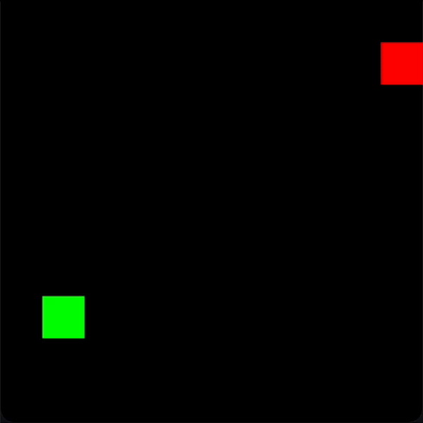

# Learning Blob 🟦

A deep reinforcement learning (Q-learning) environment involving a player, an enemy and a food object. Also includes a basic Q-learning environment without involving the use of neural networks.

Example of the simulation: (4-direction blob)

